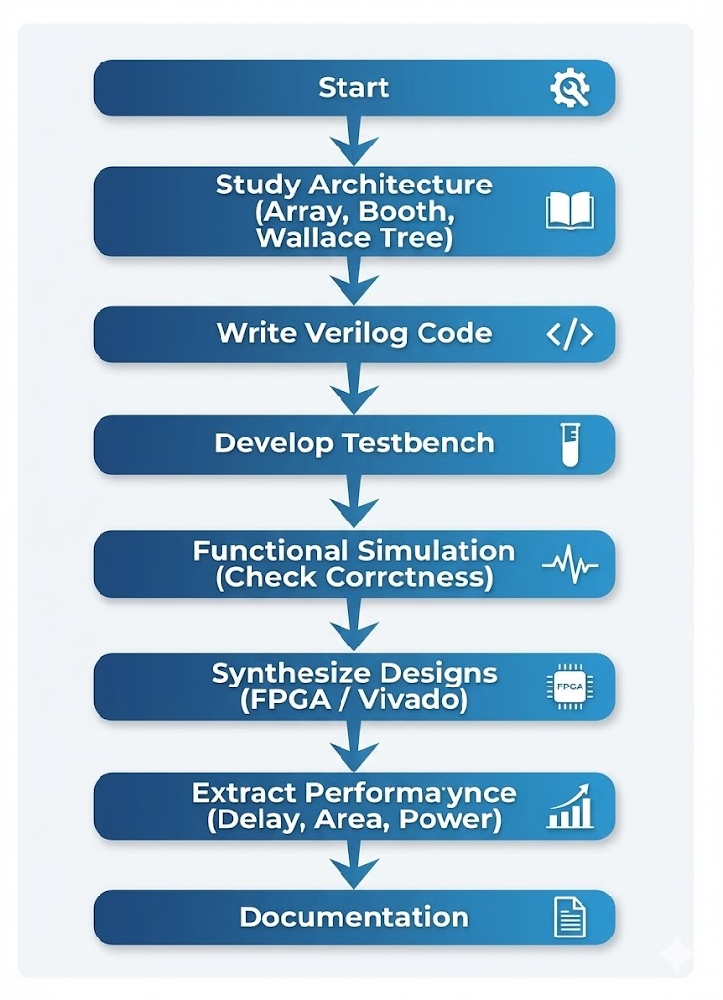
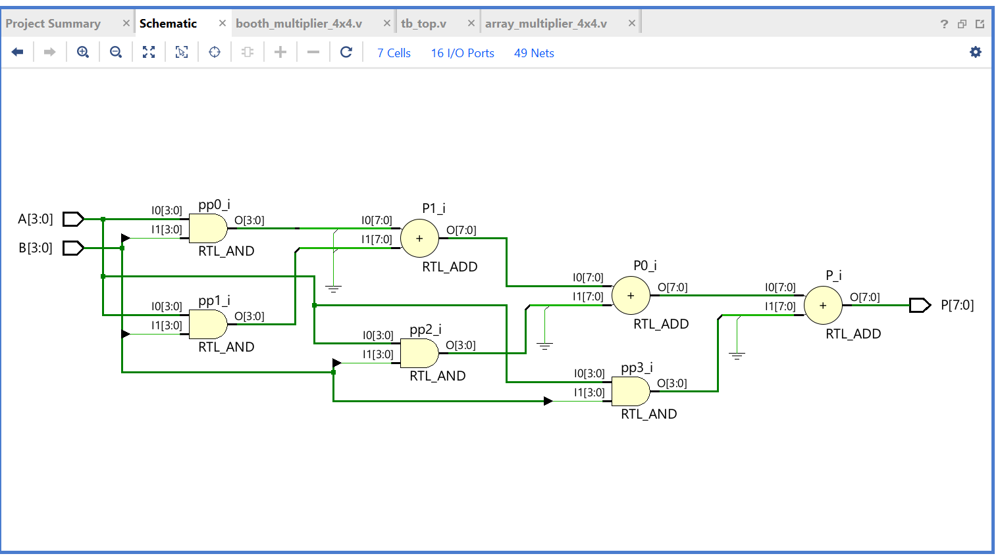
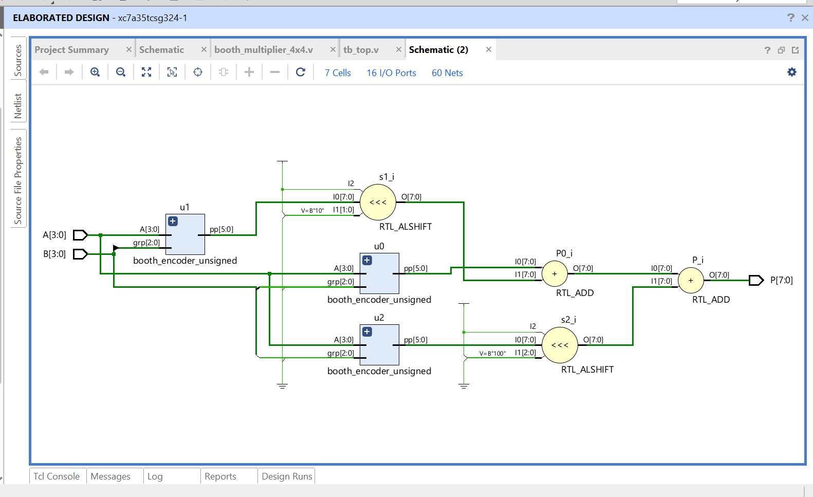
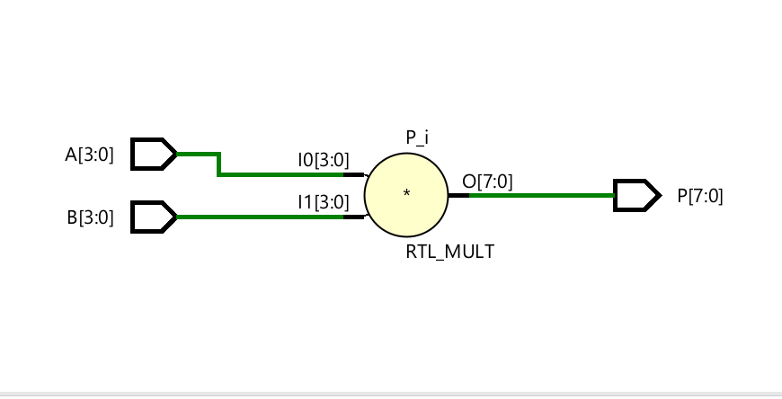
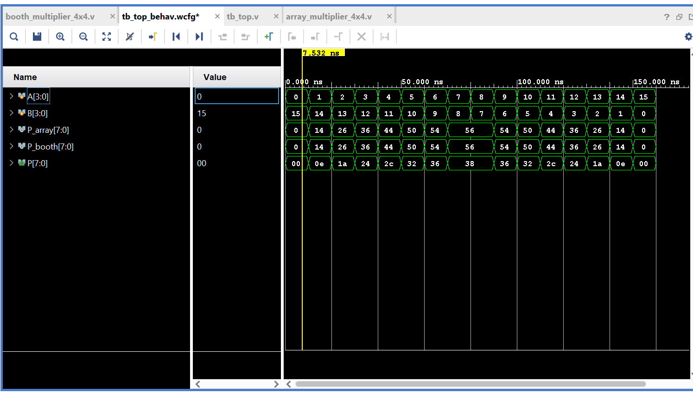
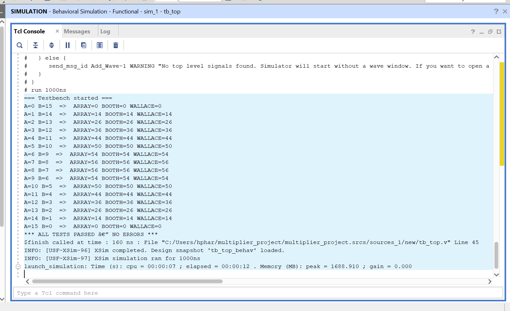

# Digital Multiplier Comparison — Array vs Booth vs Wallace Tree

Verilog HDL implementation, simulation, and FPGA synthesis comparison of three classical multiplier architectures using Xilinx Vivado (Artix-7 FPGA).

**Technologies:** Verilog HDL • Xilinx Vivado • FPGA Design • RTL Design • Digital Logic • Hardware Verification

---

## What I Built

* 4×4-bit multiplier modules for all three architectures, written as clean,
  synthesizable Verilog
* A shared `booth_encoder_unsigned` submodule implementing the full Radix-4
  Booth encoding table (`0, +A, +2A, -A, -2A`)
* A single testbench (`tb_top.v`) that drives all three designs with the same
  inputs side by side and self-checks the result against expected `A * B`
* Elaborated each design in Vivado to confirm it actually synthesizes to the
  expected structure (AND-array, Booth encoders + shifters, multiplier
  primitive)
* Ran a full implementation (synthesis + place & route) on an Artix-7 target
  and pulled real LUT/delay/power numbers for all three — not estimates

---

## Results (measured, Xilinx Vivado, Artix-7)

| Multiplier | LUTs | Delay (ns) | Power (W) |
|------------|------|------------|-----------|
| Array      | 16   | 7.092      | 0.092     |
| Wallace    | 16   | 7.092      | 0.092     |
| Booth      | 23   | 7.753      | 0.147     |

**What this actually showed me:**

* At 4-bit width, **Array and Wallace tied** for fastest delay and smallest
  area — Vivado's synthesis optimizes the Wallace reduction tree down to
  something on par with Array at this small scale, so Wallace's textbook
  speed advantage doesn't show up yet.
* **Booth was the most expensive** of the three here — 44% more LUTs and 60%
  more power than the other two — because its encoder/control logic overhead
  outweighs the partial-product savings at only 4 bits. Booth's real payoff
  shows up at larger bit-widths, which is listed below as a natural next step.
* This was a useful lesson in not trusting theory blindly: the textbook
  ranking (Wallace > Booth > Array) doesn't automatically hold at small
  operand sizes — you have to actually synthesize and measure to know.

---

## Repository Structure

```text
.
├── rtl/
│   ├── array_multiplier_4x4.v
│   ├── booth_encoder_unsigned.v
│   ├── booth_multiplier_4x4.v
│   └── wallace_multiplier_4x4.v
│
├── testbench/
│   └── tb_top.v
│
├── screenshots/
│   ├── design_flow.png
│   ├── array_multiplier_schematic.png
│   ├── booth_multiplier_schematic.png
│   ├── wallace_multiplier_schematic.png
│   ├── simulation_log.png
│   └── waveform.png
│
├── .gitignore
└── README.md
```

---

## Skills Demonstrated

**Hardware Description Languages**
* **Verilog HDL** — used throughout this project: structural and behavioral
  modeling, modular design (submodules + top-level instantiation), signed
  vs. unsigned arithmetic, parameterizable testbenches
* **VHDL** — studied and applied in coursework/other labs; comfortable
  working in either HDL depending on the toolchain or team standard

**FPGA / VLSI Toolflow**
* **Xilinx Vivado** — project setup, RTL elaboration, schematic viewing,
  behavioral simulation, synthesis, and implementation (place & route) on an
  Artix-7 device
* Reading and interpreting **synthesis/utilization reports** (LUTs, timing,
  power) to make real design trade-off decisions instead of relying on theory
* **FPGA architecture basics** — LUT-based logic mapping, how RTL constructs
  (AND arrays, shifters, adders) actually map to FPGA fabric

**Digital Design**
* RTL design of arithmetic circuits: ripple-carry addition, Booth recoding,
  partial-product generation/reduction
* Functional verification — writing self-checking testbenches, debugging
  against expected results, waveform analysis
* Computer arithmetic — two's complement, signed/unsigned multiplication,
  Radix-4 Booth algorithm

**Engineering Practice**
* Comparative, metrics-driven evaluation (delay/area/power trade-off
  analysis) rather than picking a "best" design by assumption
* Technical documentation and presenting results clearly (this README, plus
  an end-term viva presentation)

---

## How to Simulate It Yourself

Verified with [Icarus Verilog](http://iverilog.icarus.com/):

```bash
iverilog -o sim.out rtl/array_multiplier_4x4.v \
                     rtl/booth_encoder_unsigned.v \
                     rtl/booth_multiplier_4x4.v \
                     rtl/wallace_multiplier_4x4.v \
                     testbench/tb_top.v

vvp sim.out
```

```text
=== Testbench started ===
A=0 B=15 ARRAY=0 BOOTH=0 WALLACE=0
A=1 B=14 ARRAY=14 BOOTH=14 WALLACE=14
...
*** ALL TESTS PASSED — NO ERRORS ***
```

The testbench sweeps all 16 combinations of `A = 0..15` against `B = 15-A`
and checks Booth's output against the expected `A * B`. All three
architectures matched on every vector — confirmed in both Icarus Verilog and
Vivado's simulator.

---

## Design Flow



1. Study architecture (Array, Booth, Wallace Tree)
2. Write Verilog code
3. Develop testbench
4. Functional simulation
5. Synthesize on FPGA (Vivado)
6. Extract performance metrics (delay, area, power)
7. Document and compare

---

## RTL Schematics (Vivado, post-elaboration)

### Array Multiplier


### Booth Multiplier


### Wallace Tree Multiplier


---

## Simulation Evidence




---

## Next Steps

* Scale to 8×8 and 16×16 to see whether Booth and Wallace's theoretical
  advantages actually appear at larger bit-widths
* Add pipelining for higher throughput
* Try an ASIC flow (Cadence/Synopsys) instead of FPGA-only
* Drop this multiplier into a small RISC-V ALU as a real use case

---

## Author

**Harshit Panwar**
B.Tech Electronics & Communication Engineering, JIIT Noida

GitHub: [HarshitPanwar27](https://github.com/HarshitPanwar27)

---

## License

No license applied yet — all rights reserved by default.